# 🐿️ AutoChin - Automated Chinchompa Hunter Bot

**Fully automated chinchompa hunting for OSRS! Set it and forget it.** 🎉

## 🎯 What It Does
AutoChin automatically lays and maintains box traps in an optimal X-pattern, resets shaking/failed traps, and tracks your chin catches—100% hands-free!

✅ **All Chinchompas Anywhere** - Works at any chinchompa location with the exact same logic!

## ✨ Key Features
✅ **Zero Configuration** - Just start with box traps in inventory
✅ **Any Hunter Level** - Auto-adjusts trap count (1-5 based on your level)
✅ **Smart Prioritization** - Always resets oldest trap first for max efficiency
✅ **Movement Intelligence** - Prevents double-clicking and stuck states
✅ **Custom Live Overlay** - Shows Traps Laid/Max + Chins caught + Current action state

## 🚀 How to Use
1. Stand where you want traps centered
2. Have box traps in inventory
3. Start AutoChin
4. **Relax!** ☕

AutoChin handles walking, laying, monitoring, and resetting all traps automatically.

## 🏆 Perfect For
🆕 Beginners - Works at any level, no setup needed
💪 Efficiency players - Max trap uptime with oldest-first logic
😴 AFK hunters - Completely hands-free automation
📈 Grinders - Consistent XP and GP gains

## 💡 Tips
- Use flat terrain areas (Nothing blocking character movement)
- Keep inventory space for caught chins
- Bring 5+ box traps

**Author**: @The_Profaned | **Support**: freeScript Thread on BotMaker Discord

*Special thanks: @Sox, @Bik, @Khoguu, @Hobewan & BotmakerDev community*

---
## 🗒️ TODO
- ✅ Eagles Peak Quest Detection (prevent start if not completed)
- ✅ Tick Manipulation For Trap Reset
- ✅ Grey, Red, Black Chin Support (works with any chin location!)
- ✅ 1 Tick Trap
- ✅ Active Visual Tracking for Boxes
- ⚠️ Crash Detection
- [ ] 3 Tick Manipulation

## 🗒️ Changelog
- **v1.0.1 — Flag & Movement Improvements**: Fixed false flags, added Eagles Peak quest check, improved movement prediction for more reliable positioning.
- **v1.0.2a — Tick Manipulation & Stability**: Added tick manipulation for trap resets, fixed change-state detection bug, and resolved false maxTraps warnings during trap transitions.
- **v1.0.2b — Multi-Chinchompa Support**: Confirmed support for Grey, Red, and Black Chinchompas. Script works at any chinchompa location using universal box trap mechanics.
- **v1.1.0 — Speed/Consistency/Initial Crash Detection**: Initial setup now always cancels walk animation for faster trap laying. Maintenance mode prioritization improved: ground trap → lay new traps → reset shaking/failed, ensuring max trap count stays consistent. Fixed ground object interaction using correct 'Lay' menu action. Added stuck animation detection (8-tick timeout) to prevent infinite waiting on interrupted resets. First iteration of crash detection added (detects nearby players laying traps, pauses, picks up all traps, and resumes after crasher leaves - needs further refinement).
- **v1.2.0 — Advanced Overlay System & Human-Like Interactions**: Added custom Overlay + live catch tracking. Added per-trap independent overlay system with cache-based rendering. New overlays show trap states (Active/Caught!/Reset/Laying...) with color coding. Implemented more human-like clicking.
- **v1.3.0 — Full Code Re-write for State Switches** - Complete code re-write for better longevity. moved to a switch/case style code with state logic allowing better control of the script. Added true randomized tiles instead of defined x pattern (no longer remembers if there are boxes already laid as of now) verified overlay was resolved and working with less bugs on change states. 
Warning - No longer has player detection currently - will need to implement later as the re-write took way longer than expected.

## � Script Life Cycle
The following diagram illustrates the execution flow of AutoChin:

```mermaid
sequenceDiagram
    participant BM as BotMaker
    participant S as Script
    participant G as Game
    participant I as Inventory
    participant P as Player

    BM->>S: Load Script
    S->>S: onStart() - Verify quest, check inventory
    alt Eagles Peak NOT Completed
        S->>S: Print error message
        S->>BM: onEnd(false) - Stop
    else No Box Traps in Inventory
        S->>S: Print warning, mark initial setup done
    end

    loop Game Ticks (600ms)
        G->>S: onGameTick()
        
        S->>P: Check current world point
        S->>P: Compare to lastPlayerWp
        S->>S: Update isPlayerMoving flag
        
        alt relayGroundItems() - Highest Priority
            S->>G: Find ground box traps in trap locations
            alt Ground trap found?
                alt Player moving?
                    S->>S: Return early
                else
                    S->>G: Interact with ground item 'lay'
                    S->>S: waitingForAnimation = true<br/>justLaidTrap = true
                    S->>S: Return (skip other actions)
                end
            end
        end
        
        alt Tick Manipulation Check
            alt justLaidTrap && trapLaid spawned?
                alt hasTrapsReadyToReset()?
                    S->>S: Cancel walk animation<br/>waitingForAnimation = false
                else
                    S->>S: Allow full animation to play
                end
            end
        end
        
        alt waitingForAnimation && NOT resetInProgress
            S->>P: Get current animation ID
            alt Animation != -1?
                S->>S: seenAnimationDuringWait = true
                S->>S: Return (keep waiting)
            else seenAnimationDuringWait?
                S->>S: Reset waitingForAnimation flags
            end
        end
        
        alt resetInProgress && resetTargetLocation
            alt Early Tick Manip Check
                alt resetPhase = 'animating' or 'ticking'
                    alt newTrapLaid && hasTrapsReadyToReset()?
                        S->>S: Increment totalChinsCaught<br/>Cancel reset sequence<br/>tickManipulationTriggered = true
                    end
                end
            end
            
            alt PHASE 1: Walking
                alt At target?
                    S->>S: resetPhase = 'ticking'<br/>resetTickCount = 0
                else Not moving && adjacent?
                    S->>S: resetPhase = 'ticking'<br/>resetTickCount = 0
                else Not moving && stuck?
                    S->>S: Cancel reset
                end
            end
            
            alt PHASE 2: 4-Tick Delay
                S->>S: resetTickCount++
                alt resetTickCount >= 4?
                    S->>S: resetPhase = 'animating'
                end
            end
            
            alt PHASE 3: Animation Tracking
                S->>P: Get animation ID
                alt Animation != -1?
                    S->>S: resetAnimationStarted = true
                else resetAnimationStarted?
                    S->>S: Verify trap respawned<br/>Increment totalChinsCaught<br/>resetInProgress = false
                end
            end
        end
        
        alt NOT initialSetupPerformed
            S->>S: layInitialTraps()
            alt All laid?
                S->>S: initialSetupPerformed = true
                S->>S: maintenanceModeStarted = true
            end
        else maintenanceModeStarted
            alt hasTrapsReadyToReset()?
                S->>S: resetTraps() - Reset oldest trap
            else No resets needed
                alt currentTrapsGlobal < maxTraps()?
                    S->>S: layTrap() at unoccupied location
                end
            end
        end
        
        S->>S: tickManipulationTriggered = false
    end

    BM->>S: Stop Script
    S->>S: onEnd(true)
    BM->>S: Unload Script
```

